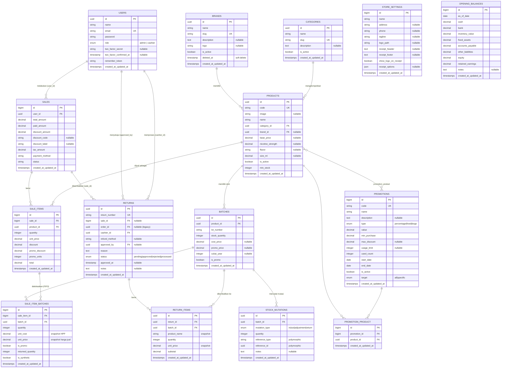

# ERD — Sistem POS Vape Story

Entity Relationship Diagram dari database aplikasi (Laravel + PostgreSQL).
Sumber: hasil pembacaan langsung seluruh file migrasi & model Eloquent.

## Cara memvisualisasikan
1. Buka <https://mermaid.live>
2. Paste blok kode `erDiagram` di bawah ini.
3. Export ke PNG/SVG untuk dimasukkan ke laporan.
   (Alternatif: draw.io → Arrange → Insert → Advanced → Mermaid.)

> Catatan tipe key: tabel inti master memakai **UUID** sebagai primary key,
> sedangkan tabel transaksi POS (`sales`, `sale_items`, `sale_item_batches`,
> `promotions`) memakai **BIGINT auto-increment**. Ini tergambar di kolom PK.

---



---

## Penjelasan relasi utama (untuk narasi laporan)

| Relasi | Kardinalitas | Keterangan |
|--------|--------------|------------|
| Users → Sales | 1 : N | Satu kasir/admin membuat banyak transaksi penjualan. |
| Categories → Products | 1 : N | Satu kategori memuat banyak produk. |
| Brands → Products | 1 : N | Satu merek memiliki banyak produk (opsional/nullable). |
| Products → Batches | 1 : N | Satu produk punya banyak batch stok (per lot/tahun cukai). |
| Sales → Sale_Items | 1 : N | Satu transaksi berisi banyak item. |
| Sale_Items → Sale_Item_Batches | 1 : N | Tiap item dialokasikan ke satu/beberapa batch (FIFO) untuk hitung HPP. |
| Batches → Sale_Item_Batches | 1 : N | Satu batch bisa dipakai di banyak penjualan. |
| Products ↔ Promotions | M : N | Via tabel pivot `promotion_product` (promo bisa berlaku ke banyak produk). |
| Sales → Returns | 1 : N | Satu transaksi dapat memiliki pengembalian (retur). |
| Returns → Return_Items | 1 : N | Satu retur berisi beberapa item yang dikembalikan. |
| Batches → Stock_Mutations | 1 : N | Setiap perubahan stok (masuk/keluar/penyesuaian/retur) tercatat. |

## Tabel pendukung (tidak terhubung relasi transaksi)
- **store_settings** — konfigurasi toko & struk (singleton, 1 baris).
- **opening_balances** — saldo awal pembukuan (referensi laporan keuangan).

## Catatan tabel legacy
Tabel `orders`, `order_items`, `transactions`, `transaction_items` merupakan
sisa desain awal sebelum alur POS berbasis `sales` diterapkan. Kolom
`returns.order_id` dipertahankan (nullable) untuk kompatibilitas data lama,
namun alur aktif menggunakan `returns.sale_id`. **Tidak perlu ditampilkan di ERD
laporan** kecuali ingin mendokumentasikan riwayat migrasi.
```
