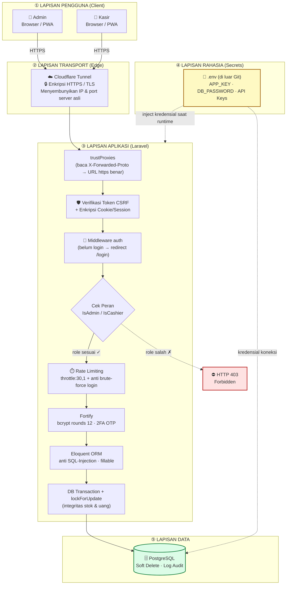

# Dokumentasi Konfigurasi, Deployment & Keamanan — Sistem POS Vape Story

Disusun berdasarkan konfigurasi nyata proyek (`composer.json`, `package.json`,
`bootstrap/app.php`, `routes/web.php`, middleware, dan `.env`).

---

## A. Spesifikasi Teknologi (Tech Stack)

| Lapisan | Teknologi | Versi |
|---------|-----------|-------|
| Bahasa server | PHP | ^8.3 |
| Framework backend | Laravel | ^13.0 |
| Autentikasi | Laravel Fortify | ^1.34 |
| Jembatan frontend | Inertia.js | ^3.0 |
| Framework frontend | Vue.js | ^3.5 |
| Build tool | Vite | ^8.0 |
| Styling | Tailwind CSS | ^4.1 |
| Database | PostgreSQL | 14+ |
| Cetak PDF (laporan) | mpdf/mpdf | ^8.3 |
| Runtime build | Node.js + npm | 20+ |

---

## B. Panduan Deployment (Menjalankan Sistem dari Nol)

### B.1 Prasyarat (yang harus terpasang lebih dulu)
- **PHP 8.3+** beserta ekstensi: `pdo_pgsql`, `mbstring`, `openssl`, `gd`, `fileinfo`.
- **Composer** (manajer dependensi PHP).
- **Node.js 20+ & npm** (untuk membangun aset frontend).
- **PostgreSQL 14+** (server database).

### B.2 Langkah Instalasi

**1) Ambil kode sumber & masuk ke folder**
```bash
git clone <url-repository> story_vape
cd story_vape
```

**2) Instalasi dependensi backend (PHP)**
```bash
composer install
```

**3) Instalasi dependensi frontend (JavaScript)**
```bash
npm install
```

**4) Siapkan berkas konfigurasi lingkungan**
```bash
cp .env.example .env
php artisan key:generate
```
> `key:generate` membuat **APP_KEY** — kunci enkripsi aplikasi (untuk session, cookie,
> dan data terenkripsi). Tanpa ini sistem menolak berjalan.

**5) Konfigurasi database di file `.env`** (ubah dari sqlite ke PostgreSQL):
```env
DB_CONNECTION=pgsql
DB_HOST=127.0.0.1
DB_PORT=5432
DB_DATABASE=vapor
DB_USERNAME=postgres
DB_PASSWORD=********
```

**6) Bangun struktur tabel & data awal**
```bash
php artisan migrate          # buat semua tabel
php artisan db:seed          # akun awal + data master (opsional)
```

**7) Bangun aset frontend**
```bash
npm run build                # produksi (output siap pakai)
# atau "npm run dev" saat pengembangan (hot-reload)
```

**8) Jalankan aplikasi**
```bash
php artisan serve            # http://127.0.0.1:8000
```

> **Pintasan:** seluruh langkah 2–7 sudah dibungkus dalam satu perintah
> `composer setup` (lihat `composer.json`): `composer install` → salin `.env` →
> `key:generate` → `migrate` → `npm install` → `npm run build`.

### B.3 Catatan untuk Produksi
- Set `APP_ENV=production` dan `APP_DEBUG=false` (mencegah bocornya detail error).
- Jalankan cache konfigurasi: `php artisan config:cache && php artisan route:cache`.
- Akses publik HTTPS disediakan lewat **Cloudflare Tunnel** (lihat bagian Keamanan C.4).

---

## C. Penanganan Keamanan Sistem

### C.1 Kerahasiaan Kredensial — file `.env`
Seluruh data sensitif **tidak ditulis di dalam kode**, melainkan disimpan di file
`.env` yang **tidak ikut di-commit** ke Git (di-*ignore*). Contoh yang disimpan di `.env`:
- `APP_KEY` — kunci enkripsi aplikasi.
- `DB_USERNAME` & `DB_PASSWORD` — kredensial database.
- `AWS_ACCESS_KEY_ID` / `AWS_SECRET_ACCESS_KEY` — kredensial penyimpanan (bila dipakai).

> Akibatnya, walau kode sumber bocor, kredensial produksi tetap aman karena berada
> di luar repositori.

### C.2 Keamanan Autentikasi & Kata Sandi
- **Hashing kata sandi** — password tidak pernah disimpan apa adanya. Model `User`
  memakai cast `'password' => 'hashed'` (algoritma **bcrypt**, `BCRYPT_ROUNDS=12`),
  sehingga password tersimpan dalam bentuk *hash* satu arah.
- **Kebijakan kata sandi kuat** — saat membuat/mengubah akun, password wajib:
  minimal **8 karakter**, kombinasi **huruf besar-kecil**, **angka**, dan **tidak
  pernah bocor** di kebocoran data publik (validasi `uncompromised()` / cek Have I Been Pwned).
  *(Lihat `UserController::strongPassword()`.)*
- **Autentikasi Dua Faktor (2FA)** — tersedia via Laravel Fortify
  (`TwoFactorAuthenticatable`) dengan kode OTP & *recovery codes*.
- **Pembatasan percobaan login (rate limiting)** — Fortify membatasi percobaan login
  untuk mencegah serangan *brute-force*.

### C.3 Pembatasan Hak Akses Pengguna (Otorisasi Berbasis Peran)
Sistem memiliki **2 peran**: `admin` dan `cashier`, ditegakkan berlapis:

1. **Middleware peran** (`bootstrap/app.php`): alias `admin` → `IsAdmin`,
   `cashier` → `IsCashier`.
2. **Proteksi rute** (`routes/web.php`):
   - Grup `/admin/*` dilindungi middleware `['auth', 'admin']` — **hanya admin**.
   - Grup `/pos/*` dilindungi middleware `['auth', 'cashier']` — kasir & admin.
   - Pengunjung tanpa login otomatis diarahkan ke `/login` (middleware `auth`).
   - Akses tak berhak ditolak dengan **HTTP 403 Forbidden**.
3. **Pemeriksaan ganda di controller** — fungsi sensitif memanggil `abortIfNotAdmin()`
   sebagai lapis pertahanan tambahan.
4. **Pembatasan laju pada endpoint sensitif** — manajemen akun dibatasi
   `throttle:30,1` (maks. 30 permintaan/menit).

| Area | Path | Middleware | Akses |
|------|------|-----------|-------|
| Panel Admin | `/admin/*` | `auth`, `admin` | Admin saja |
| Aplikasi Kasir | `/pos/*` | `auth`, `cashier` | Kasir & Admin |
| Manajemen Akun | `/admin/users` | + `throttle:30,1` | Admin saja |

### C.4 Keamanan Transport (SSL/HTTPS)
- Akses publik dilewatkan melalui **Cloudflare Tunnel**, sehingga koneksi pengguna
  terenkripsi **HTTPS/TLS** end-to-end tanpa membuka port server langsung ke internet.
- Laravel dikonfigurasi `trustProxies(at: '*')` di `bootstrap/app.php` agar mengenali
  header `X-Forwarded-Proto` dari Cloudflare dan menghasilkan URL `https://` yang benar.

### C.5 Proteksi Bawaan Framework
- **CSRF Protection** — setiap form/permintaan POST diverifikasi token CSRF
  (middleware web Laravel) untuk mencegah *Cross-Site Request Forgery*.
- **Enkripsi Cookie & Session** — cookie dienkripsi (`encryptCookies`); session
  dapat dienkripsi via `SESSION_ENCRYPT`.
- **Anti SQL Injection** — seluruh akses data lewat **Eloquent ORM** dengan
  *parameter binding*, bukan query string mentah.
- **Proteksi Mass Assignment** — tiap model membatasi kolom yang boleh diisi massal
  melalui properti `$fillable`.
- **XSS** — Vue.js melakukan *escaping* output secara default saat me-render data.

### C.6 Integritas & Jejak Audit Data
- **Transaksi Database Atomik** — proses pembayaran & retur dibungkus
  `DB::transaction` (commit/rollback) agar stok dan uang tidak pernah setengah jadi.
- **Penguncian Baris (row locking)** — `lockForUpdate()` saat memotong stok mencegah
  *race condition* bila dua kasir menjual produk sama bersamaan.
- **Soft Delete pada akun** — menghapus akun hanya menandai `deleted_at`; data tetap
  ada sehingga **riwayat transaksi tidak ikut hilang**.
- **Log Audit** — aksi penting (buat/ubah/hapus akun) dicatat ke log aplikasi
  beserta identitas pelaku, waktu, dan objek yang diubah.

---

## D. Ringkasan Aspek Keamanan (untuk tabel laporan)

| No | Aspek Keamanan | Implementasi pada Sistem |
|----|----------------|--------------------------|
| 1 | Kerahasiaan kredensial | Disimpan di `.env`, di luar repositori Git |
| 2 | Penyimpanan password | Hashing bcrypt (rounds 12), tidak pernah plaintext |
| 3 | Kebijakan password | Min 8, huruf besar-kecil, angka, cek kebocoran (HIBP) |
| 4 | Autentikasi 2 faktor | Laravel Fortify (OTP + recovery codes) |
| 5 | Anti brute-force | Rate limiting login + `throttle:30,1` |
| 6 | Otorisasi peran | Middleware `IsAdmin`/`IsCashier` + proteksi rute (403) |
| 7 | Enkripsi transport | HTTPS/TLS via Cloudflare Tunnel |
| 8 | CSRF | Token CSRF pada semua permintaan web |
| 9 | SQL Injection | Eloquent ORM + parameter binding |
| 10 | Mass assignment | Properti `$fillable` per model |
| 11 | Integritas data | DB transaction + row locking |
| 12 | Jejak audit | Log aksi + soft delete akun |

---

## E. Diagram Arsitektur Keamanan

Visualisasi keamanan **berlapis (defense in depth)**: setiap permintaan pengguna
harus melewati beberapa "gerbang" sebelum menyentuh data.

**Cara render:** paste blok di bawah ke <https://mermaid.live> → export PNG/SVG.



### Penjelasan alur (untuk narasi laporan)
1. **Pengguna** (Admin/Kasir) hanya bisa mengakses sistem lewat **HTTPS**.
2. Permintaan masuk lewat **Cloudflare Tunnel** yang mengenkripsi koneksi (TLS) dan
   menyembunyikan server asli dari internet.
3. Di **Laravel**, permintaan disaring berurutan: token **CSRF** → wajib **login**
   (`auth`) → **cek peran** (admin/kasir). Bila peran tidak sesuai → ditolak **403**.
4. Permintaan yang lolos dibatasi **rate limit**, lalu diproses dengan password
   ter-*hash* (Fortify), query aman **Eloquent**, dan **transaksi atomik**.
5. **Kredensial** (DB, API key) tidak ada di kode — di-*inject* dari **`.env`** saat
   runtime.
6. Data disimpan di **PostgreSQL** dengan **soft delete** dan **log audit** sehingga
   riwayat tetap utuh dan tertelusur.
