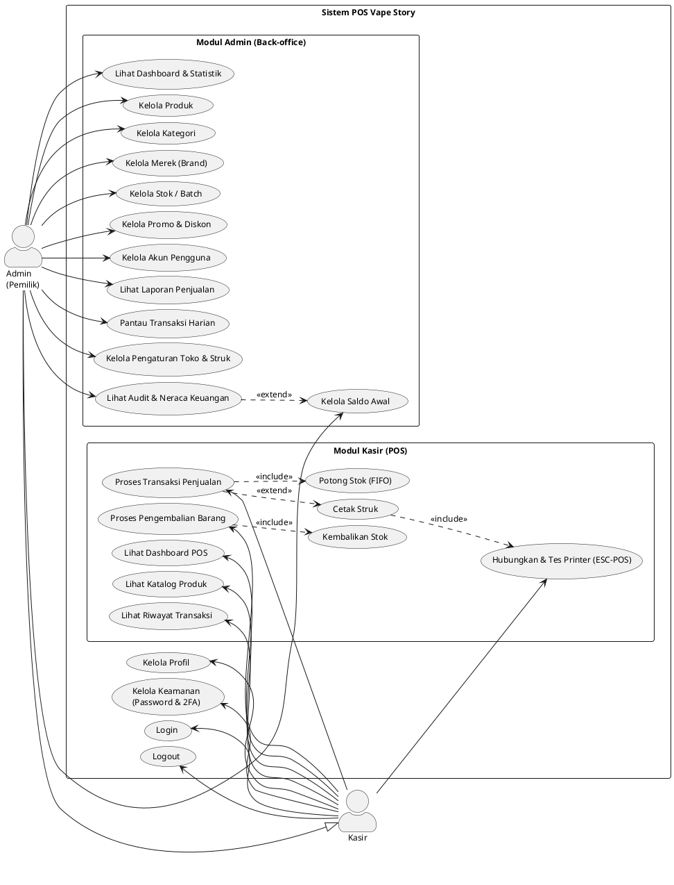
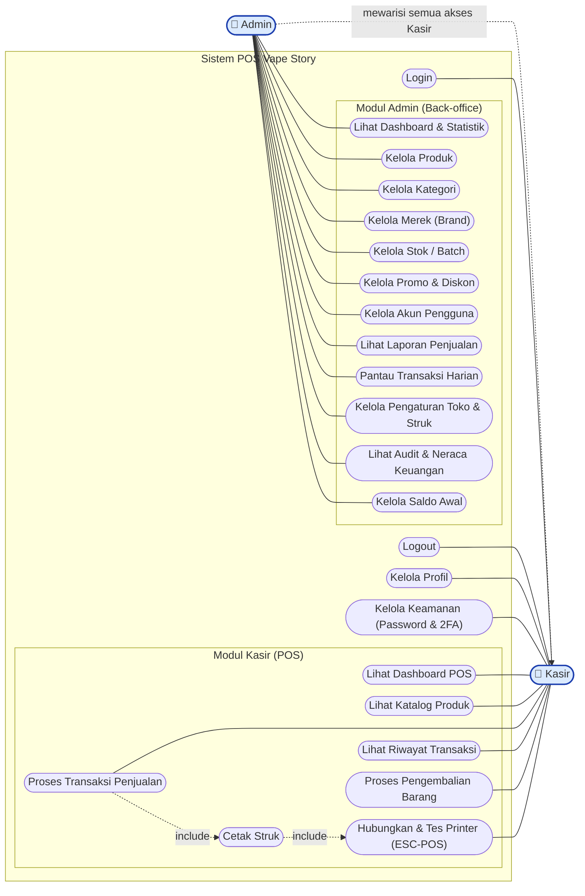

# Use Case Diagram — Sistem POS Vape Story

Aktor & use case diturunkan **langsung dari route + controller + halaman nyata**
(`routes/web.php`, `routes/settings.php`, `config/fortify.php`, sidebar Admin & POS).

- **Aktor:** Admin (pemilik) dan Kasir.
- **Use case bersama:** Login, Logout, Kelola Profil, Kelola Keamanan (Password & 2FA).
- **Generalisasi:** Admin **mewarisi** semua use case Kasir — Admin juga dapat
  mengakses seluruh fitur POS (route `/pos/*` memakai middleware `IsCashier` yang
  mengizinkan `isCashier() || isAdmin()`). Sebaliknya, Kasir **tidak** bisa mengakses
  fitur Admin (route `/admin/*` admin-only).
- **Catatan registrasi:** registrasi publik **nonaktif** (Fortify tanpa
  `Features::registration()`); akun hanya dibuat Admin lewat *Kelola Akun Pengguna*.

---

## Versi A — PlantUML (UML Use Case ASLI) ✅ direkomendasikan

**Cara pakai:** buka <https://www.plantuml.com/plantuml/uml> → paste kode di bawah →
otomatis jadi gambar → klik PNG/SVG untuk unduh.
(Alternatif: extension "PlantUML" di VS Code.)

---

## Versi B — Mermaid (alternatif, BUKAN UML murni)

**Cara pakai:** paste ke <https://mermaid.live>. Ini gaya *flowchart*, dipakai bila
hanya butuh gambaran cepat dan diizinkan dosen.

---

## Daftar Use Case (untuk narasi laporan) — dipetakan ke route nyata

| Aktor | Use Case | Sumber (route / halaman) |
|-------|----------|--------------------------|
| Admin & Kasir | Login, Logout | Fortify (`/login`, `/logout`) |
| Admin & Kasir | Kelola Profil | `settings/profile` → `ProfileController` |
| Admin & Kasir | Kelola Keamanan (Password & 2FA) | `settings/security`, `settings/password` → `SecurityController`, Fortify 2FA |
| Admin | Lihat Dashboard & Statistik | `admin/dashboard` → `Admin\DashboardController` |
| Admin | Kelola Produk | `admin/products` (CRUD) → `Admin\ProductController` |
| Admin | Kelola Kategori / Merek / Stok-Batch | `admin/categories`, `admin/brands`, `admin/products/{}/batches` |
| Admin | Kelola Promo & Diskon | `admin/promotions` (CRUD + toggle) → `Admin\PromotionController` |
| Admin | Kelola Akun Pengguna | `admin/users` (CRUD) → `Admin\UserController` |
| Admin | Lihat Laporan Penjualan | `admin/reports/sales` (+ export, pdf, shopping-list) |
| Admin | Pantau Transaksi Harian | `admin/transactions/today` → `Admin\TodayTransactionController` |
| Admin | Kelola Pengaturan Toko & Struk | `settings/store` → `Settings\StoreController` (admin-only) |
| Admin | Lihat Audit & Neraca Keuangan | `admin/__audit`, `__audit/neraca-detail` → `Admin\AuditController` *(tersembunyi, akses via URL)* |
| Admin | Kelola Saldo Awal | `admin/__audit/opening-balance` → `Admin\OpeningBalanceController` *(dari halaman audit)* |
| Kasir (+Admin) | Lihat Dashboard POS | `pos/dashboard` → `POS\DashboardController` |
| Kasir (+Admin) | Lihat Katalog Produk | `pos/products` → `POS\ProductController` |
| Kasir (+Admin) | Proses Transaksi Penjualan | `pos/payment/process` → `POS\ProcessPaymentController` |
| Kasir (+Admin) | Lihat Riwayat Transaksi | `pos/transactions/today` → `POS\TodayTransactionController` |
| Kasir (+Admin) | Proses Pengembalian Barang | `pos/returns` (index/store) → `POS\ReturnController` |
| Kasir (+Admin) | Hubungkan & Tes Printer (ESC-POS) | `pos/printer-test` + `PrinterStatusBadge` (Web Bluetooth) |

**Catatan relasi:**
- *Admin* **«generalization»** *Kasir* — Admin mewarisi seluruh use case Kasir, sehingga Admin juga dapat mengakses semua fitur POS (di samping fitur khusus admin). Kasir tidak mewarisi use case admin.
- *Proses Transaksi Penjualan* **«include»** *Potong Stok (FIFO)* — pemotongan stok (alokasi batch FIFO) selalu terjadi saat transaksi.
- *Proses Transaksi Penjualan* **«extend»** *Cetak Struk* — pencetakan struk bersifat opsional setelah pembayaran.
- *Cetak Struk* **«include»** *Hubungkan & Tes Printer (ESC-POS)* — struk dicetak lewat printer ESC-POS yang dipasangkan via Web Bluetooth.
- *Proses Pengembalian Barang* **«include»** *Kembalikan Stok* — stok selalu dikembalikan saat retur diproses.
- *Lihat Audit & Neraca Keuangan* **«extend»** *Kelola Saldo Awal* — penyetelan saldo awal (neraca pembuka) dilakukan dari halaman audit yang tersembunyi.
